# PokeDex
Pokedex is kotlin multiplatform project with 99% shared code, built with Compose multiplatform

## Open-source libraries
- [Kotlin](https://kotlinlang.org/) based, [Coroutines](https://github.com/Kotlin/kotlinx.coroutines) + [Flow](https://kotlin.github.io/kotlinx.coroutines/kotlinx-coroutines-core/kotlinx.coroutines.flow/) for asynchronous.
- [Kotlin Serialization](https://github.com/Kotlin/kotlinx.serialization): Kotlin multiplatform / multi-format serialization.
- [Compose multiplatform](https://github.com/JetBrains/compose-multiplatform): a modern UI framework for Kotlin.
- [Decompose](https://github.com/arkivanov/Decompose): for navigation.
- [Ktor](https://github.com/ktorio/ktor): for making network requests.
- [SqlDelight](https://github.com/cashapp/sqldelight): for caching data.
- [Koin](https://github.com/InsertKoinIO/koin): a pragmatic lightweight dependency injection framework.
- [DataStore KMP](https://developer.android.com/kotlin/multiplatform/datastore): uses Kotlin coroutines and Flow to store data asynchronously in a key-value pairs.
- MVI + Clean Architecture ([Check it out](https://medium.com/@sharmapraveen91/mastering-mvi-clean-architecture-for-android-a-comprehensive-guide-with-clean-code-and-tdd-best-98272fabe4f2/))
- [Material 3](https://m3.material.io/components): Material 3 components.

## App Screenshot 📷:  
### Android
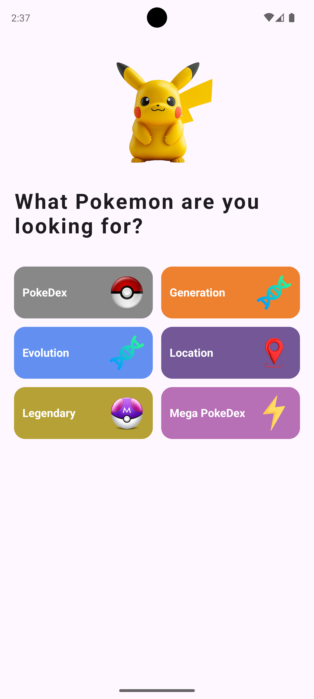&nbsp;&nbsp;&nbsp;&nbsp;
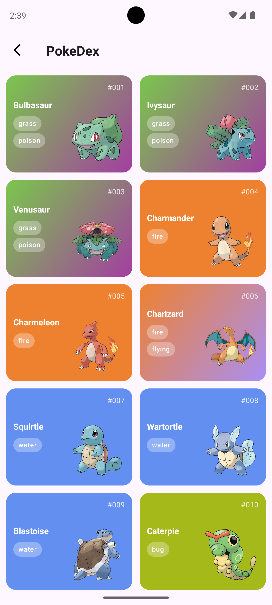&nbsp;&nbsp;&nbsp;&nbsp;
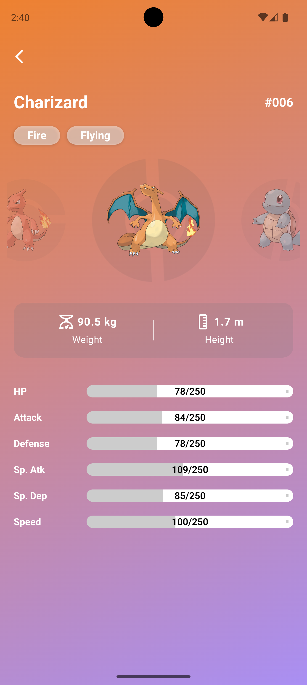&nbsp;&nbsp;&nbsp;&nbsp;
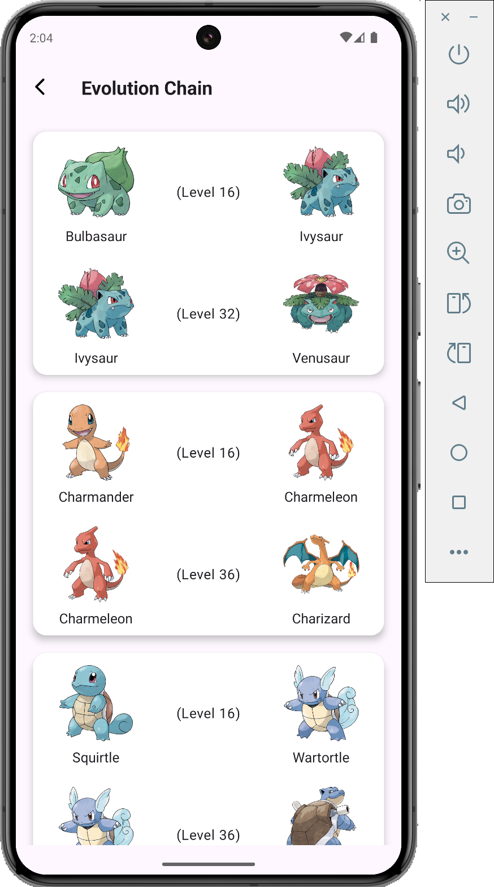&nbsp;&nbsp;&nbsp;&nbsp;
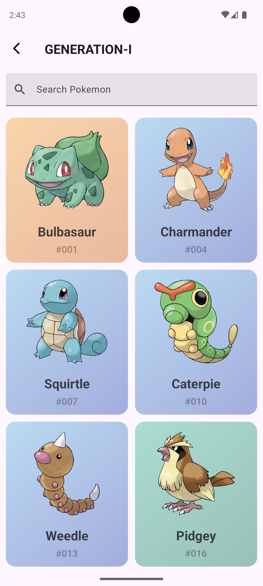&nbsp;&nbsp;&nbsp;&nbsp;

### IOS
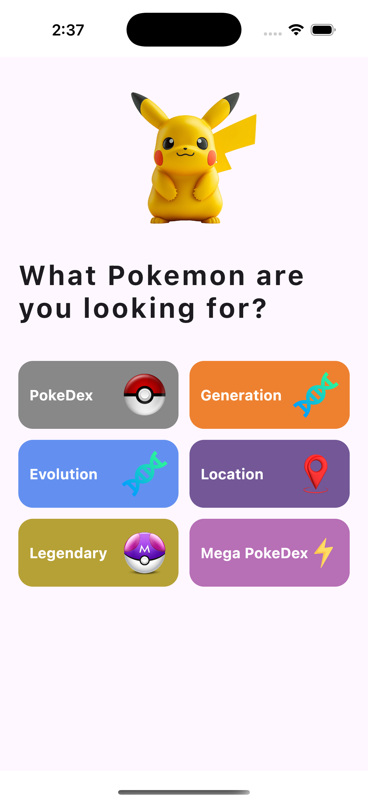&nbsp;&nbsp;&nbsp;&nbsp;
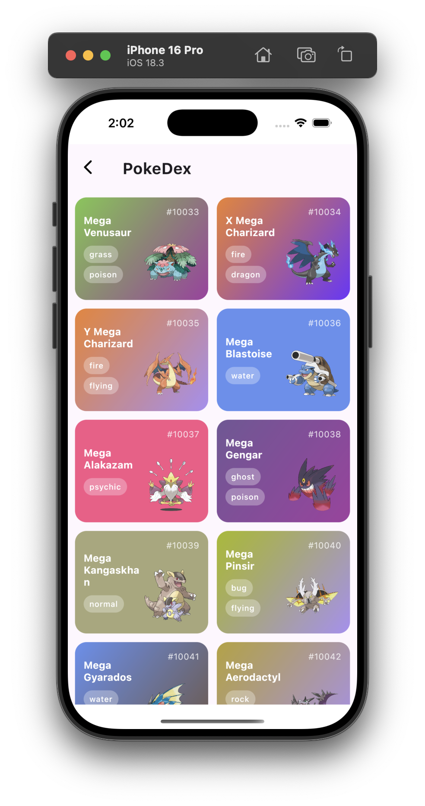&nbsp;&nbsp;&nbsp;&nbsp;
&nbsp;&nbsp;&nbsp;&nbsp;
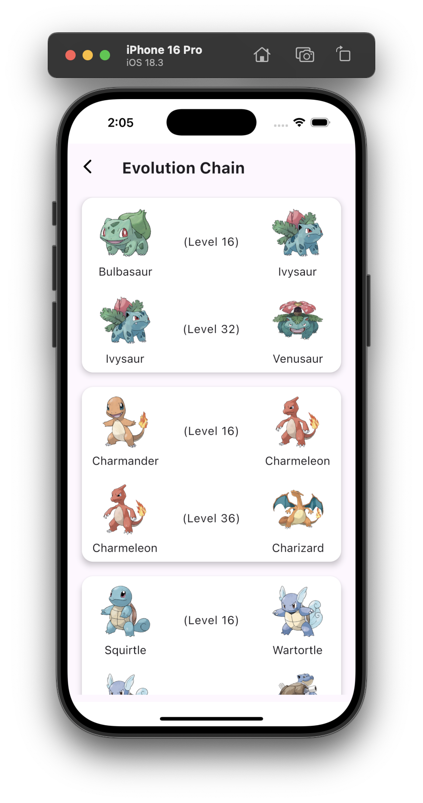&nbsp;&nbsp;&nbsp;&nbsp;
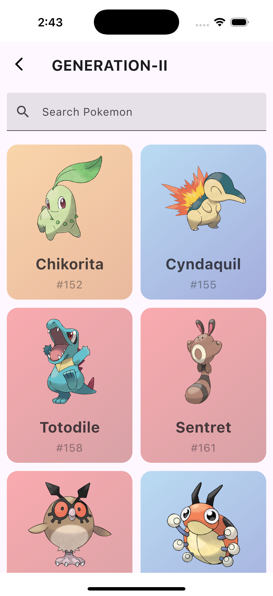&nbsp;&nbsp;&nbsp;&nbsp;

### Desktop
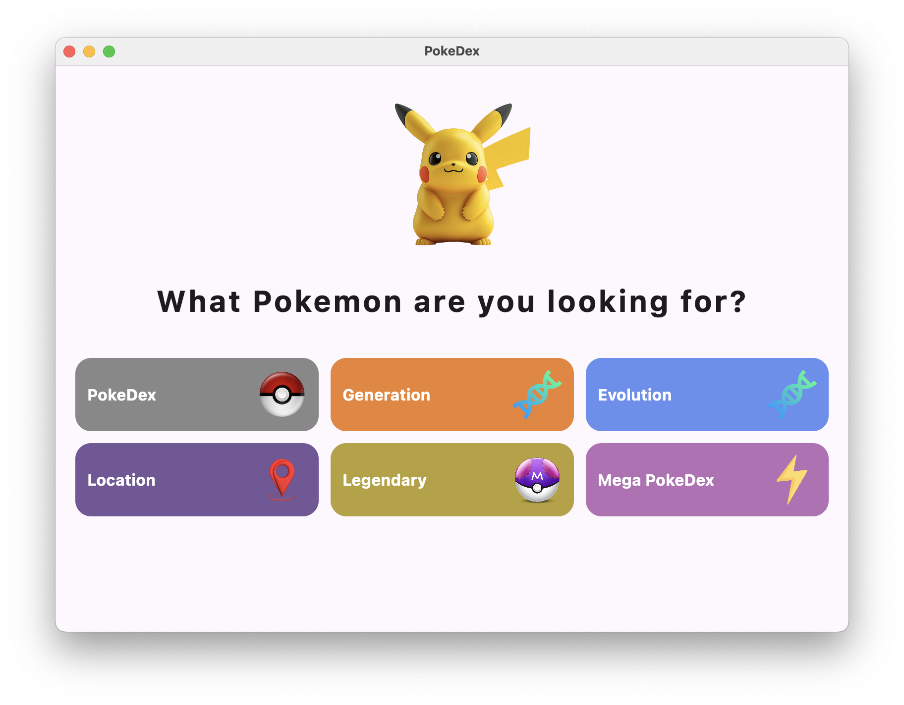&nbsp;&nbsp;&nbsp;&nbsp;
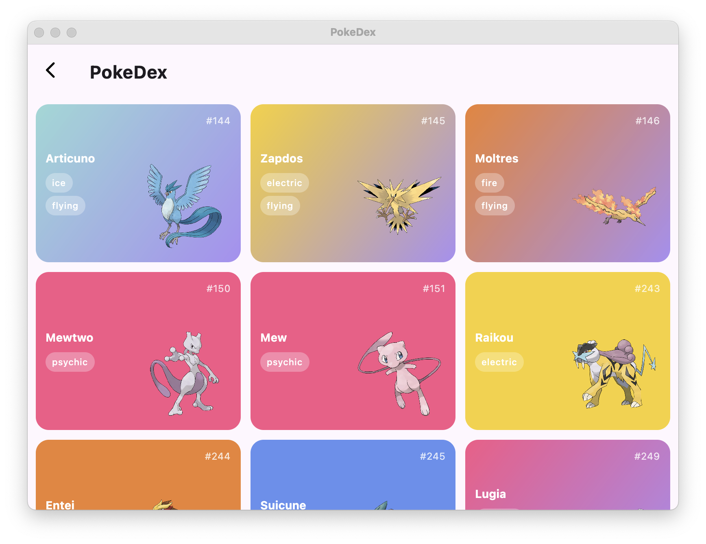&nbsp;&nbsp;&nbsp;&nbsp;
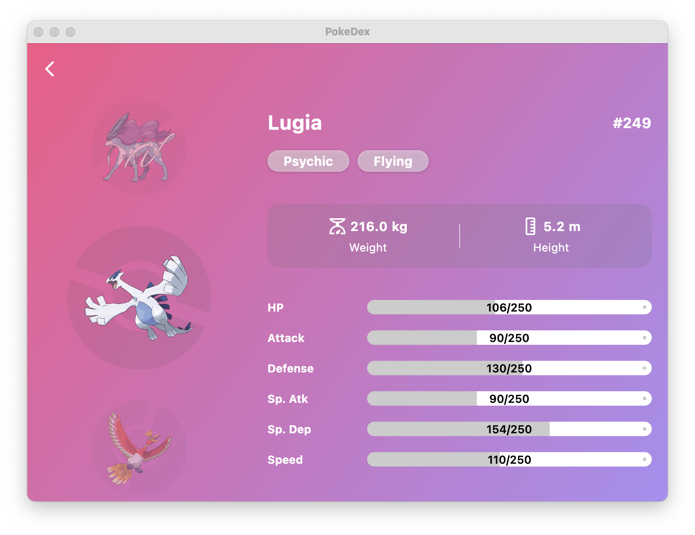&nbsp;&nbsp;&nbsp;&nbsp;
